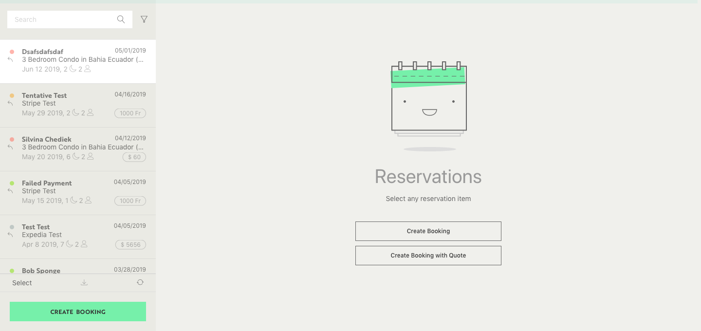
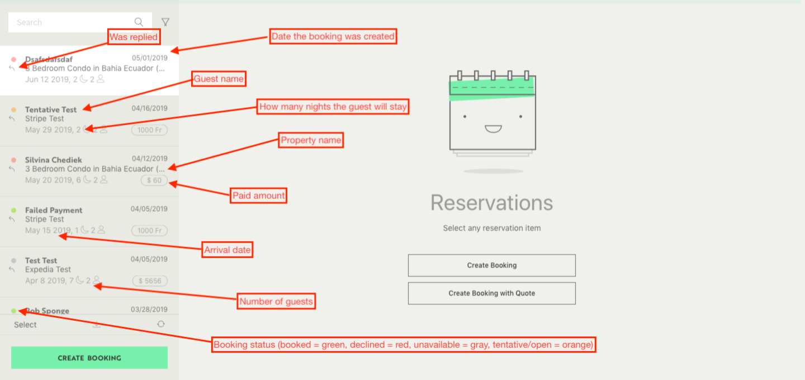

Based on the boilerplate given to you:

- try to recreate the list shown in the following images.
- try to add the search functionality so that the list is filtered by `guestName`. This should be done only in the frontend.

| Design                     | Legend                     |
| -------------------------- | -------------------------- |
|  |  |

## Run the project

1. Clone the repo.
2. Install dependencies with `yarn`.
3. Run the project with `yarn dev`.

## Suggestion

We will evaluate both your javascript and css. Please note that we will be paying more attention to the application behaviour so don't waste time on pixel perfection.

## Submitting your work

1. Fork this repo.
2. Do your magic. You can change anything you want to except `modules/api`.
3. Submit a PR **to your own fork** or send us a ZIP file via e-mail.

## ⚠️

- This project is based on [Next.js](https://nextjs.org). Check their [documentation](https://nextjs.org/docs) if you need to.  
  Feel free to reach out to us if you get stuck on this. It is **not** the purpose of this task.
